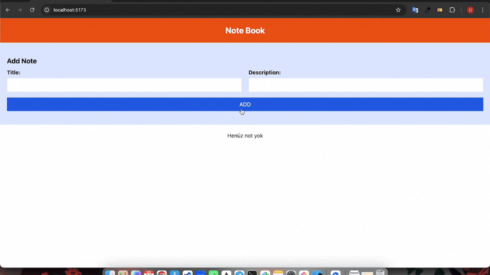

<h1>MERN Stack Note App</h1>

Basit bir not yönetim uygulaması. Kullanıcılar not ekleyebilir, silebilir ve güncelleyebilir.
Bu proje, React tabanlı bir frontend ve Express/MongoDB tabanlı bir backend içerir.

<h2>Kullanılan Teknolojiler</h2>

Frontend:

- React: Kullanıcı arayüzü

- React Router: Sayfa yönlendirmeleri

- Tailwind CSS: Stil yönetimi

- Vite: Geliştirme ve derleme aracı

Backend:

- Express.js: Sunucu tarafı

- MongoDB & Mongoose: Veritabanı yönetimi

- dotenv: Çevresel değişken yönetimi

- cors: CORS politikalarını yönetme

<h2>Özellikler</h2>

- Not ekleme

- Not silme

- Not güncelleme

- Verilerin MongoDB ile saklanması

<h2>Ekran Videosu</h2>

